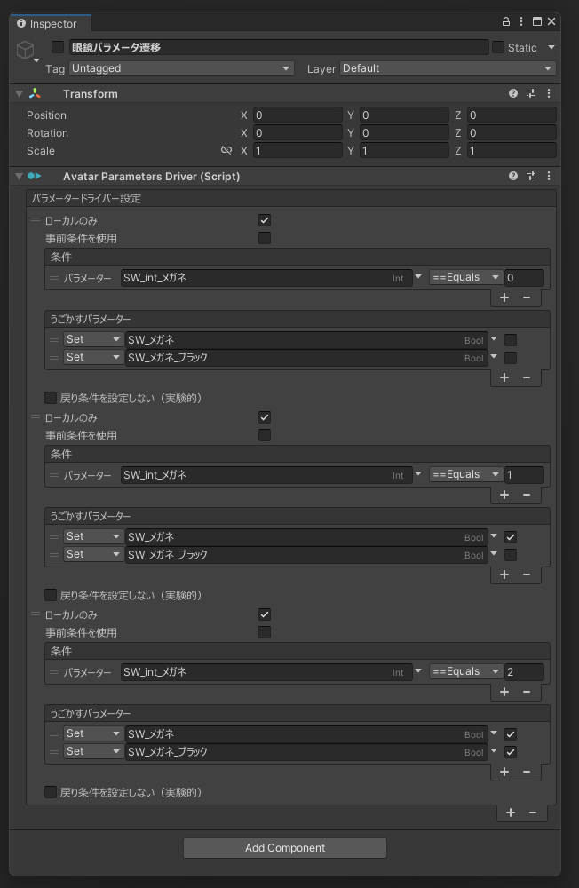

# vrchat-shuzuku

## これなに
VRCパラメータの依存関係整理するの形式言語で書きたい…！  
という個人的需要からユーザースクリプトで整理できるようにしました

NDMFとMAに依存しています

## 具体的に
[Avatar Parameters Driver](https://github.com/Narazaka/AvatarParametersDriver)でやっていた作業をLINQ的に書けるようにしました


### before  


### after  
```
using System.Collections.Generic;
using net.yarukizero.vrchat.shizuku;

[ShizukuClient]
class Megane : ShizukuTemplate {
  protected override IEnumerable<ShizukuResult> DoDefine(ShizukuHost host)
    => new ShizukuResult[] {
      host.Entry()
        .Condition(x => (x["SW_int_メガネ"] == 0))
        .Action(x => x["SW_メガネ"].Set(false))
        .Action(x => x["SW_メガネ_ブラック"].Set(false))
        .LocalOnly(true)
        .Result(),
      host.Entry()
        .Condition(x => x["SW_int_メガネ"] == 1)
        .Action(x => x["SW_メガネ"].Set(true))
        .Action(x => x["SW_メガネ_ブラック"].Set(false))
        .LocalOnly(true)
        .Result(),
      host.Entry()
        .Condition(x => x["SW_int_メガネ"] == 2)
        .Action(x => x["SW_メガネ"].Set(true))
        .Action(x => x["SW_メガネ_ブラック"].Set(true))
        .LocalOnly(true)
        .Result(),
    };
}
```

そして当然ループなども使えるのでこう書けます

```
private static readonly (bool On, bool Black)[] template = new (bool, bool)[] {
  (false, false),
  (true, false),
  (true, true),
};

protected override IEnumerable<ShizukuResult> DoDefine(ShizukuHost host) 
  => template.Select((x, i) => host.Entry()
    .Condition(y => (y["SW_int_メガネ"] == i))
    .Action(y => y["SW_メガネ"].Set(x.On))
    .Action(y => y["SW_メガネ_ブラック"].Set(x.Black))
    .LocalOnly(true)
    .Result()).ToArray();
```

## 使い方
アバタールートまたは配下の`GameObject`に`ShizukuProcesser`を追加します  
`Aeestsフォルダ`の好きなところにC# スクリプトを作成します  
クラスにShizukuClient属性を付与して`ShizukuTemplate`を継承または`IShizuku`を実装します  
クラス名は見てないのでなんでもいいです  
よしなに


## 注意事項
実験的プロダクトなので今後の見通しは不鮮明  
各種名称もあまり固まっていません  
このNDMFプラグインはユーザースクリプトを実行するためセキュリティリスクがあります  
理解して使用してください


##  それでshizukuってなに
適当に降ってきたコードネームに深い意味なんてないよ


